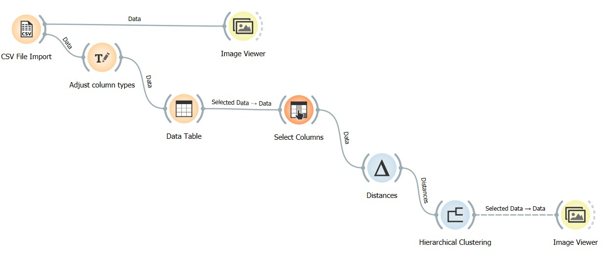
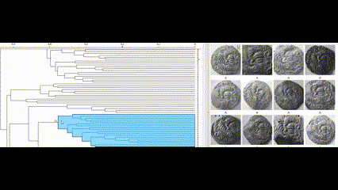

# Die Study
----

Notebooks:
- `Preprocessing`: Use this to apply the filters used for preprocessing the image.
- `Extract_Matches`: Use this to extract the matches in a directory and to save them in a csv file.

After extracting the matches we used [Orange Data Mining](https://orangedatamining.com/) to apply the hierarchical clustering and visualise the result.

