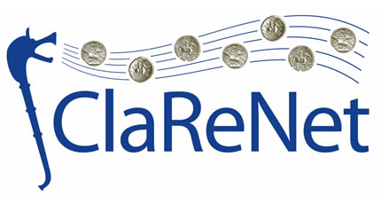

# CAA 2023 

----

This repository contains the code or links to repositories that were used for Clarenet's work on the hoard of Le Câtillon II in the paper: Supporting the analysis of a large coin hoard with AI-based methods 2023

----

# Images

All coin images belong to [Jersey Heritage](https://www.jerseyheritage.org/). We are grateful to be working on them.
You can have a look on the original dataset [here](https://catalogue.jerseyheritage.org/collection-search/?filters[0][field]=tab.keyword&filters[0][term]=Archaeology&filters[0][bool]=must&filters[1][field]=object_number&filters[1][term]=STATES/CATII&filters[1][bool]=must&filters[1][type]=match)

----
# References
- `Albumentations`: Buslaev, Alexander, Vladimir I. Iglovikov, Eugene Khvedchenya, Alex Parinov, Mikhail Druzhinin, and Alexandr A. Kalinin. 2020. "Albumentations: Fast and Flexible Image Augmentations" Information 11, no. 2: 125. https://doi.org/10.3390/info11020125https://github.com/albumentations-team/albumentations
- Heinecke, Andreas, Emanuel Mayer, Abhinav Natarajan, & Yoonju Jung (2021). Unsupervised Statistical Learning for Die Analysis in Ancient Numismatics. CoRR, abs/2112.00290.
- `Centernet`: Kaiwen Duan, , Song Bai, Lingxi Xie, Honggang Qi, Qingming Huang, and Qi Tian. "CenterNet: Keypoint Triplets for Object Detection".CoRR abs/1904.08189 (2019).
- `DeepCluster`: Caron, Mathilde, Piotr, Bojanowski, Armand, Joulin, and Matthijs, Douze. "Deep Clustering for Unsupervised Learning of Visual Features." . In European Conference on Computer Vision.2018.
https://github.com/facebookresearch/deepcluster
- [GradCam Implementation](https://github.com/keras-team/keras-io/blob/master/examples/vision/grad_cam.py)
- Heinecke, Andreas, Emanuel Mayer, Abhinav Natarajan, and Yoonju Jung. "Unsupervised Statistical Learning for Die Analysis in Ancient Numismatics".CoRR abs/2112.00290 (2021).
- [Keras Applications](https://keras.io/api/applications/)
- `LabelImg`: Tzutalin. LabelImg. Git code (2015). https://github.com/tzutalin/labelImg
- `Lime` : Ribeiro, Marco Tulio, Sameer Singh, and Carlos Guestrin. "Why should i trust you?: Explaining the predictions of any classifier." Proceedings of the 22nd ACM SIGKDD International Conference on Knowledge Discovery and Data Mining. ACM, 2016.
-  `Nonlinear total variation`: Leonid I. Rudin, Emad Fatemi. "Nonlinear total variation based noise removal algorithms". Physica D: Nonlinear Phenomena (1992).
-  [Nonlinear total variation Implementation](https://github.com/danoan/image-processing)
- `Shap`: Lundberg, Scott M, and Su-In, Lee. "A Unified Approach to Interpreting Model Predictions.". In Advances in Neural Information Processing Systems. Curran Associates, Inc., 2017. https://github.com/slundberg/shap
- Taylor, Zachary McCord, "The Computer-Aided Die Study (CADS): A Tool for Conducting Numismatic Die Studies with Computer Vision and Hierarchical Clustering" (2020). Computer Science Honors Theses. 54.
- [TensorFlow 2 Model Zoo](https://github.com/tensorflow/models/blob/master/research/object_detection/g3doc/tf2_detection_zoo.md)
- [Tensorflow 2 Object Detection API](https://github.com/tensorflow/models/blob/master/research/object_detection/g3doc/tf2.md)
- [Training Custom Object Detector](https://tensorflow-object-detection-api-tutorial.readthedocs.io/en/latest/training.html)
- `VGG16`: Simonyan, K., & Zisserman, A. (2014). Very Deep Convolutional Networks for Large-Scale Image Recognition. CoRR, abs/1409.1556.
- [XRAI Implementation](https://github.com/PAIR-code/saliency)
